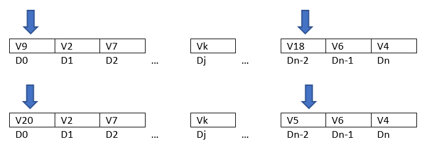

# Simulated annealing
Se implementa esta metaheurística sin memoria y de solución única en base al modelamiento II especificado en el documento Modelamiento matemático preliminar.

A partir del algoritmo se tiene que:

- Input: Parámetros del enfriamiento
- $s = s_0$ **Generación de solución inicial**
- $T = T_{max}$
- Repetir
    - Repetir a un temperatura fija
        - $s'$ = **Generar vecino de $s$**
        - $\delta E = f(s')-f(s)$
        - si $\delta E \leq 0$ entonces
            - $s = s'$
        - si no Aceptar $s'$ con probabilidad $e^{\frac{-\delta E}{T}}$
    - Hasta **Condición de Estabilidad**
    - $T = \alpha T$
- Hasta que $T < Tmin$

Los parámetros necesarios corresponden a:
```
alpha: valor que actualizará la temperatura actual
temperaturaMin: temperatura mínima 
temperaturaMax: temperatura máxima
threshold: toleracia para finalizar el ciclo de enfriamiento
iteraciones: número de iteraciones a una temperatura fija (condición de equilibrio estática)
```
Se solicita que estos sean especifícados en un archivo de configuración YALM. Se entregan tres configuraciones para instancias pequeñas, medianas y grandes (`confSA-small.yml`,`confSA-medium.yml`,`confSA-big.yml`).

A continuación, se especifican la generación de la solución inicial, la generación de vecinos y la condición de estabilidad. 


## Generación de la solución inicial
La solución inicial se crea con una porción golosa y un porción aleatoria. 
La sección golosa del algoritmo consiste en asignar cada vehículo a la demanda con la que tiene un menor un menor costos.

A continuación, todas aquellas demandas sobrantes son inicializadas aleatoriamente. En caso de que no sea posible generar una solución factible al asignar un vehículo a una demanda esta se deja sin inicializar y se pasa a la siguiente. Para así satisfacer la mayor cantidad de demandas posibles.


## Generación de vecinos
Debido al diseño de la solución, se opta por una vencidad generada a partir de la elección aleatoria de n-demandas a las cuáles se les aplica la modificación del vehículo asignado de manera aleatoria, pero cumpliendo con las restricciones obviamente.

Por ejemplo en la siguiente imagen, esta vecindad es aplicada con 2 demandas.


## Condición de Estabilidad

Antes de que haya un cambio de temperatura se exije que la solución actual se estabilice. En esta implementación sencilla simplemente se le entrega un número de iteraicón antes de pasar a la siguiente temperatura
